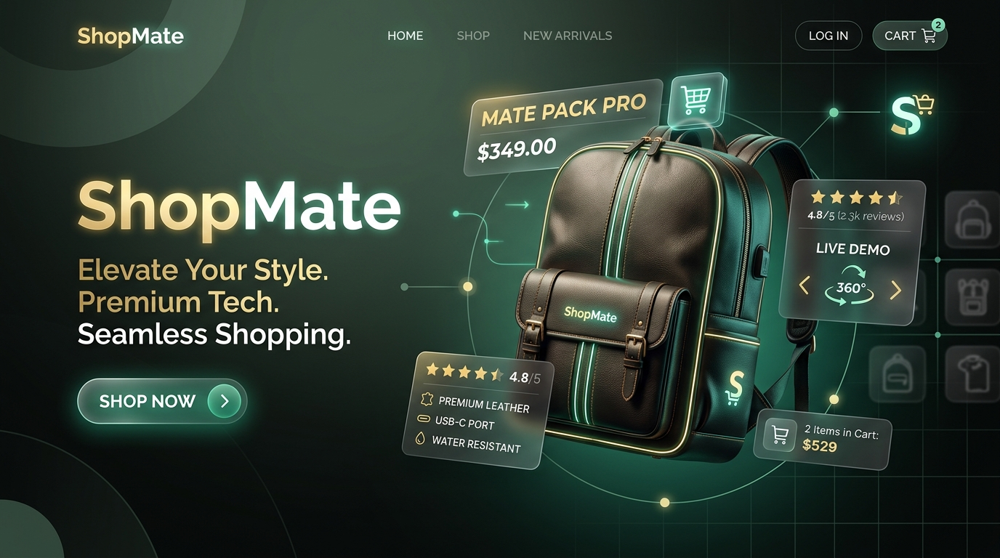
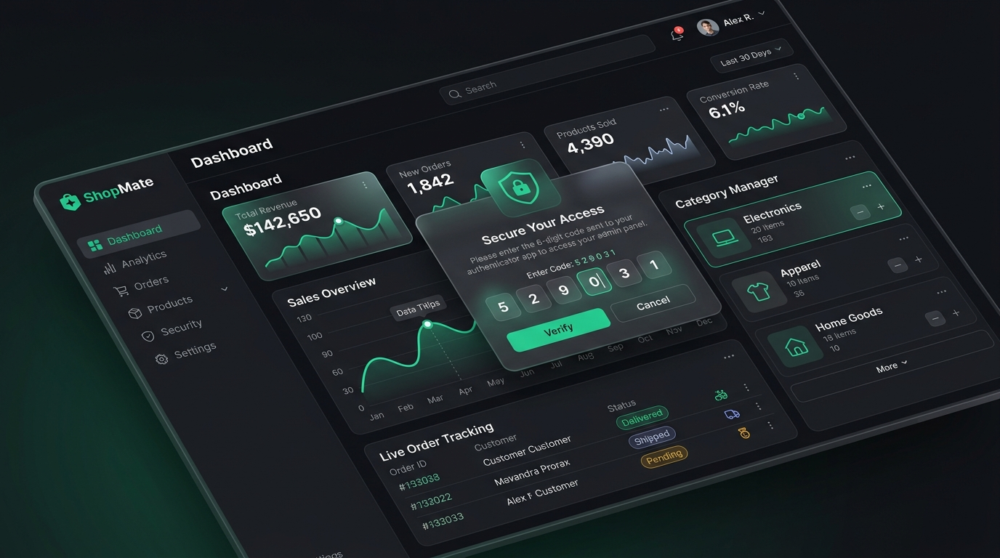
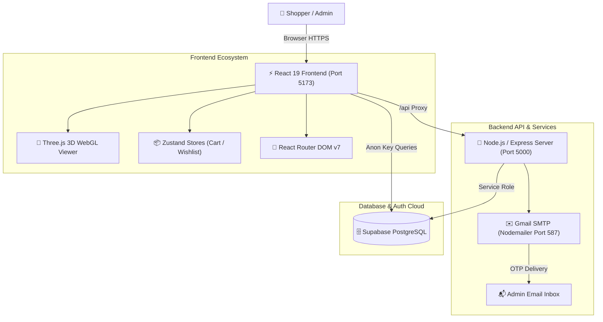

<div align="center">

<!-- Animated Header Banner -->


<br/><br/>

[](https://react.dev/)
[](https://vitejs.dev/)
[](https://tailwindcss.com/)
[](https://threejs.org/)
[](https://supabase.com/)
[](https://nodejs.org/)
[](https://opensource.org/licenses/MIT)

<br/>

**A next-generation, enterprise-grade e-commerce application powered by React 19, real-time Supabase cloud database, interactive Three.js 3D WebGL product inspection, and enterprise 2FA security with automated Gmail SMTP.**

<br/>

[✨ Features](#-key-features) • [⚡ 3D Experience](#-interactive-3d-webgl-viewer) • [🛡️ 2FA Admin](#-admin-console--2fa-security) • [📦 Installation](#-getting-started) • [🛠️ Tech Stack](#️-technology-stack) • [💬 Customer Support](#-24x7-customer-support)

<br/>

<!-- Hero Banner Showcase -->


</div>

---

## 🌟 Overview

**ShopMate** reimagines modern digital retail by combining high-speed client rendering with realistic 3D product customization and robust enterprise administration. Built with high architectural fidelity, it eliminates sluggish static images in favor of interactive 360° product exploration, live inventory tracking, and bulletproof multi-factor authentication.

```text
 🛒 Customer Journey          ⚡ Realtime Core             🛡️ Enterprise Security
──────────────────────      ─────────────────────       ─────────────────────────
• 360° 3D Model Viewer      • Supabase PostgreSQL       • SHA-256 OTP Verification
• Instant Multi-Category    • Zustand State Cache       • Gmail SMTP STARTTLS (587)
• Persistent Cart & Wish    • Vite Ultra-Fast HMR       • Role-Based Access Control
```

---

## 🚀 Key Features

### 1. 🛍️ Consumer Experience & Catalog
- **Curated Multi-Category Structure**: Seamless navigation across *Electronics, Fashion, Home & Kitchen, Beauty, Sports*, and *Accessories*.
- **Multi-View Image Galleries**: Multi-perspective angle carousels with smooth transitions and zoom-ins.
- **Smart Filtering & Instant Search**: Debounced client-side and database queries by category, price range, and tags.
- **Persistent Cart & Wishlist**: Powered by persistent Zustand local stores, preserving cart quantities across reloads.
- **Streamlined Checkout Flow**: Form validation, address book integration, coupon discount codes, and live tax computation.

### 2. ⚡ Interactive 3D WebGL Viewer
- **Physics-Based 3D Rendering**: Powered by Three.js (r183) with dynamic ambient/key lighting and contact drop shadows.
- **360° OrbitControls**: Responsive drag, tilt, and touch gestures allowing customers to inspect products from every conceivable angle.
- **Dynamic PBR Color Swatches**: Real-time material texture and shade changes (Navy Blue, Forest Olive, Stealth Black, Desert Tan) with zero frame drops.

### 3. 🛡️ Admin Portal & 2FA Two-Factor Authentication
- **Secure Authentication Guard**: Protected routes ensuring administrative access is restricted to verified personnel.
- **Automated OTP Delivery**: High-deliverability transactional emails sent over Gmail SMTP via Port 587 STARTTLS.
- **Anti-Spam Multi-Part Email Template**: Responsive HTML + plain-text fallback ensuring zero spam folder delivery.
- **Hash Verification with Rate Limiting**: Client-side SHA-256 verification hashes with a 5-minute expiry and strict attempt counters.
- **Comprehensive Admin Suite**: Product CRUD, inventory stock thresholds, order status lifecycle manager, and revenue analytics.

---

## 🎮 Interactive 3D WebGL Viewer

<div align="center">

```
   ┌──────────────────────────────────────────────────────────┐
   │                  Three.js WebGL Canvas                   │
   │                                                          │
   │       🔄 360° Drag         🎨 Real-Time PBR Swatches     │
   │      [ OrbitControls ]       [ Black | Navy | Tan ]      │
   │                                                          │
   │                  🎒 3D Model (.GLB)                      │
   │             Soft Ground Shadows & HDR Lights             │
   └──────────────────────────────────────────────────────────┘
```

</div>

The hero product features an interactive Three.js 3D canvas with smooth touch/mouse orbit interaction:
- **Model Loader**: Asynchronous `GLTFLoader` with responsive loading skeleton state.
- **Lighting Setup**: Multi-point directional key light, fill ambient radiance, and directional shadows.
- **Performance**: Automated frame-rate throttling when canvas is out of viewport to preserve GPU resources.

---

## 🛡️ Admin Console & 2FA Security

<div align="center">

</div>

<br/>

### Two-Factor Authentication Workflow:
1. **Admin Credentials Entered**: Admin submits root credentials at `/admin/login`.
2. **Dynamic 6-Digit OTP Generation**: A cryptographically random OTP is generated by the server.
3. **Gmail SMTP Dispatch**: The code is delivered to the administrator's email within seconds via Nodemailer.
4. **Time-Limited Challenge**: The modal requires the 6-digit PIN within a 5-minute validity window.
5. **Session Initiation**: Once validated, an encrypted authentication token is granted.

---

## 📂 Product Categories Showcase

| Category | Imagery | Featured Brands / Items |
| :--- | :---: | :--- |
| **Electronics** |  | Noise-cancelling headphones, smartwatches, ultra-thin smartphones. |
| **Fashion** |  | Streetwear, premium jackets, designer sneakers, and watches. |
| **Home & Kitchen** |  | Minimalist cookware, ceramic planters, espresso machines. |
| **Beauty** |  | Organic serums, gentle facial cleansers, luxury cosmetics. |
| **Sports** |  | Pro running gear, fitness trackers, resistance bands. |
| **Accessories** |  | Leather backpacks, polarized sunglasses, stainless steel tumblers. |

---

## 🏗️ System Architecture



---

## 🛠️ Technology Stack

| Layer | Technologies | Purpose |
| :--- | :--- | :--- |
| **Frontend Framework** | **React 19**, **Vite 8** | Ultra-responsive UI, instant hot-module replacement |
| **Styling & Design** | **Tailwind CSS 3.4**, **Vanilla CSS** | Modern aesthetic, dark accents, custom glassmorphism |
| **3D Rendering** | **Three.js (r183)**, **OrbitControls** | Interactive WebGL 3D model viewport |
| **State Management** | **Zustand 5** | Persistent browser cache for cart, wishlist, and tokens |
| **Backend & APIs** | **Node.js**, **Express 4**, **Nodemailer** | RESTful API endpoints & transactional email dispatch |
| **Database & Auth** | **Supabase** (PostgreSQL) | Real-time catalog, product storage, customer accounts |
| **Icons & Transitions** | **Lucide React**, **Framer Motion 12** | Micro-interactions, animated cards, accessible icons |

---

## 📦 Getting Started

### Prerequisites
* **Node.js**: v18.0.0 or higher
* **npm**: v9.0.0 or higher
* **Supabase Account**: (URL & Anon API Key)
* **Gmail Account**: With an [App Password](https://myaccount.google.com/apppasswords) configured

---

### Step 1: Clone & Install Dependencies

```bash
# Clone the repository
git clone https://github.com/gowtham786786/E-Commerce-web.git
cd E-Commerce-web

# Install frontend dependencies
npm install

# Install backend dependencies
cd backend
npm install
cd ..
```

---

### Step 2: Environment Configuration

Create a `.env` file in the root directory:

```env
# Frontend API Base URL
VITE_API_URL="http://localhost:5000"

# Supabase Credentials
VITE_SUPABASE_URL="https://your-project.supabase.co"
VITE_SUPABASE_ANON_KEY="your-supabase-anon-key"
SUPABASE_SERVICE_ROLE_KEY="your-supabase-service-role-key"

# Gmail SMTP 2FA Email Dispatcher
EMAIL_USER="your-email@gmail.com"
EMAIL_PASS="your-16-character-app-password"
```

> 💡 **App Password Tip**: In your Google Account, enable **2-Step Verification**, search for **App passwords**, create one named `ShopMate`, and copy the 16-character code into `EMAIL_PASS`.

---

### Step 3: Run the Development Servers

Open two terminals to launch both services:

#### Terminal 1 — Backend API Server
```bash
npm run server
# Running at: http://localhost:5000
```

#### Terminal 2 — Frontend Application
```bash
npm run dev
# Running at: http://localhost:5173
```

---

## 🔗 Local Access Endpoints

| Service | Localhost URL | Description |
| :--- | :--- | :--- |
| **Frontend Store** | [http://localhost:5173](http://localhost:5173) | Main customer shopping portal |
| **Admin Login & 2FA** | [http://localhost:5173/admin/login](http://localhost:5173/admin/login) | Protected admin portal with OTP delivery |
| **Customer Support Hub** | [http://localhost:5173/profile?tab=support](http://localhost:5173/profile?tab=support) | 24x7 Help Desk & FAQ center |
| **Backend Health Check** | [http://localhost:5000/api/health](http://localhost:5000/api/health) | API heartbeat and service status |

---

## 💬 24x7 Customer Support

We are dedicated to providing responsive customer support for any shopping, tracking, returns, or technical inquiries.

<div align="center">

| Channel | Contact Details | Operating Hours |
| :--- | :--- | :--- |
| 📧 **Customer Support Email** | [**reddygowtham397@gmail.com**](mailto:reddygowtham397@gmail.com) | 24/7 (Average response < 2 hrs) |
| 💬 **WhatsApp Priority Support** | [**+91 90031 25941**](https://wa.me/919003125941) | Monday – Saturday (9:00 AM – 8:00 PM IST) |
| 📞 **Customer Helpline** | **+91 63030 68154** | Monday – Saturday (9:00 AM – 8:00 PM IST) |

</div>

---

## 📜 Database Seeding

To initialize the Supabase database with the complete category and product catalog:

```bash
node scripts/seed_full_catalog.js
```

<details>
<summary><b>Click to expand Database Schema Details</b></summary>

- **`categories` Table**:
  - `id` (UUID, Primary Key)
  - `name` (TEXT)
  - `slug` (TEXT, Unique)
  - `image` (TEXT)
  - `created_at` (TIMESTAMP)

- **`products` Table**:
  - `id` (UUID, Primary Key)
  - `name` (TEXT)
  - `description` (TEXT)
  - `price` (NUMERIC)
  - `category_id` (UUID, Foreign Key)
  - `stock` (INT)
  - `images` (ARRAY)
  - `rating` (NUMERIC)
  - `reviews_count` (INT)
  - `featured` (BOOLEAN)
  - `bestseller` (BOOLEAN)
</details>

---

## 🔒 Security & Code Quality

- **Protected Secrets**: Zero secrets in client-side bundles; all keys are guarded by `.gitignore`.
- **MIME Multi-part Compliance**: Ensures high email inbox delivery rates and eliminates false spam flagging.
- **Modern Standards**: Fully linted with [Oxlint](https://oxc-project.github.io/) for high-speed JS/JSX analysis.

---

## 👨‍💻 Author & Maintainer

* **Developer**: Gowtham ([@gowtham786786](https://github.com/gowtham786786))
* **Support Contact**: [reddygowtham397@gmail.com](mailto:reddygowtham397@gmail.com)
* **License**: [MIT License](LICENSE)

<div align="center">
  <sub>Built with ❤️ by Gowtham. If you found this project helpful, feel free to give it a ⭐ on GitHub!</sub>
</div>
